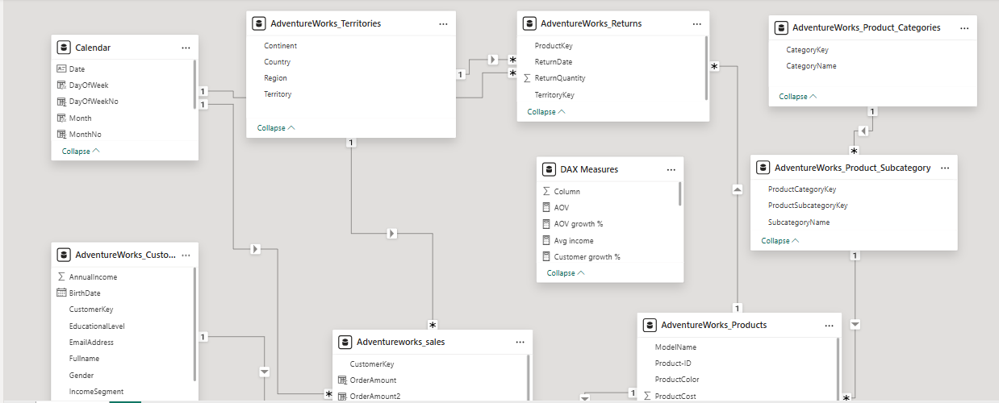
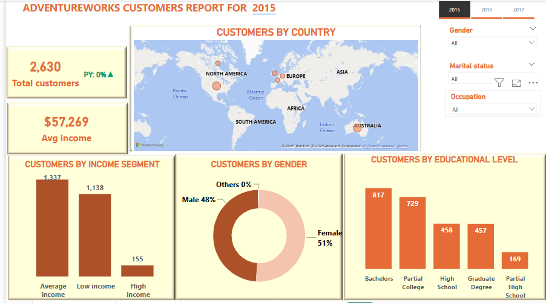
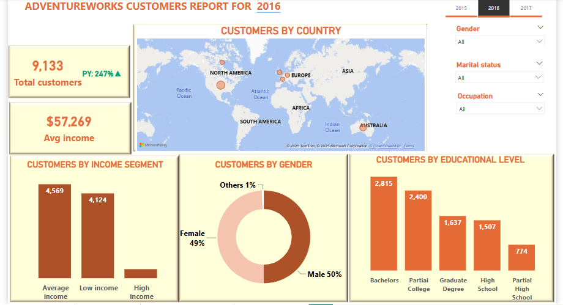
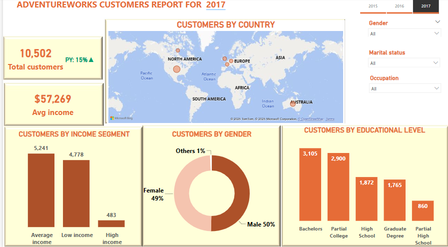
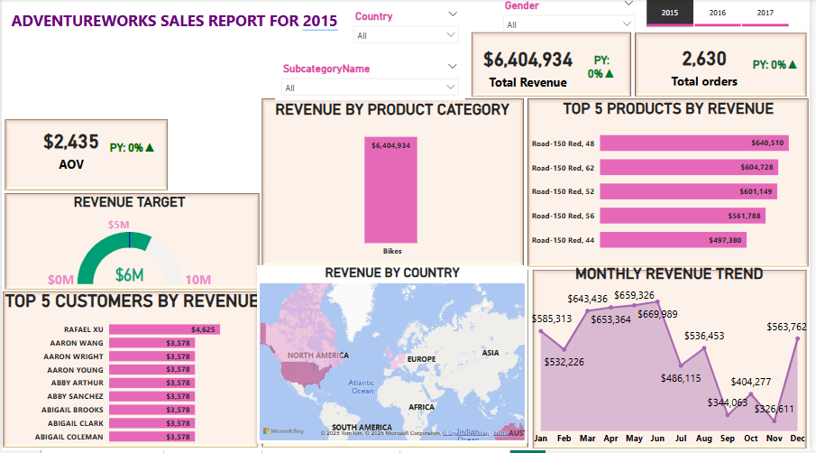
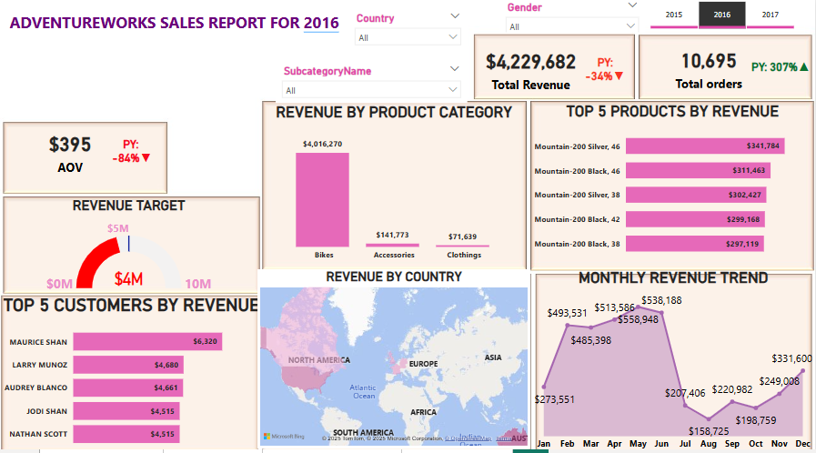
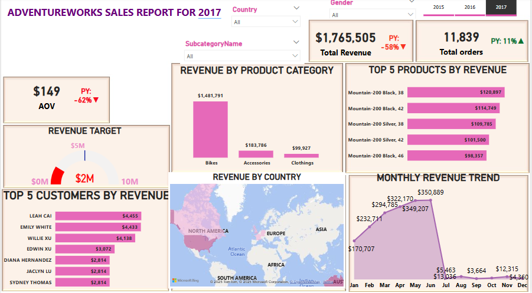

### AdventureWorks Customer and Sales Analysis Report 

## Table of Contents
1. [Overview](#overview)
2. [Problem statement](#problem_statement)
3. [Tool](#tool)
4. [Skills demonstrated](#skills_demonstrated)
5. [Data modelling](#data_modelling)
6. [Findings](#findings)
   - Customer Dashboard
   - Sales Dashboard
7. [Conclusion](#conclusion)

---
### Overview
This report provides an analysis of AdventureWorks' customer and sales data from the year 2015 to 2017, using two dashboards: the Customer Dashboard and the Sales Dashboard.

 **Customer Dashboard:** Focuses on understanding customer demographics, educational levels, income segments, and geographical distribution.
 
 **Sales Dashboard:** Highlights revenue distribution by products, customers, regions, and monthly trends while evaluating progress toward revenue targets.

---
### Problem Statement
This analysis highlights key areas for AdventureWorks to focus on for growth and optimization. By leveraging the findings, the company can better target customers, enhance product offerings, and maximize revenue potential. 
The analysis addresses the following business questions:

1. Who are AdventureWorks' key customers, and what are their demographics?
2. Which regions and product categories generate the most revenue?
3. Are there opportunities to increase sales among underperforming customer groups or regions?
4. How well is the business meeting its revenue targets?

---
### Tool
- Power BI (data cleaning, data visualization and dashboard creation)

---
### Skills demonstrated
- Segmentation: Grouping customers by income levels, gender, and education.
- Created formulas: created different DAX formulas
- Data visualization: Use of bar charts, pie charts, geographical maps, and KPIs.
- Analytical storytelling: Deriving actionable insights from data.

---
### Data modelling
The analysis has one fact table and different dimension tables. 

---
### Findings

**Customer Dashboard Findings (2015)**

 **Key Metrics**
 
- Total Customers:** 2,630
- Average Income:** $57,269

1. **Customer Demographics**
- Gender Distribution: 51% of customers are female, and 48% are male.
- Educational Levels: Most customers have a Bachelor's degree (817) or partial college education (729).

2. **Income Segments**
- The largest customer group falls under "Average Income" (1,337), followed by "Low Income" (1,138), with a small proportion in "High Income" (155).

3. **Geographical Distribution**
- North America has the highest concentration of customers, followed by Europe and Asia.

   

  
**Customer Dashboard Findings (2016)**

  **Key Metrics**
   - Total Customers: 9,133.
   - Average Income: $57,269. 

**Customer Demographics**
- Gender Distribution: 49% of customers are female, 50% are male and 1% are others.
- Educational Levels: Most customers have a Bachelor's degree (2,815), or a partial college education (2,400) and the least customer has a partial high school education (774).

2. **Income Segments**
- The largest customer group falls under "Average Income" (4,569), followed by "Low Income" (4,124), with a small proportion in "High Income" (440).

3. **Geographical Distribution**:
- North America has the highest concentration of customers, followed by Europe and Asia.
  
   
  
  
**Customer Dashboard Findings (2017)**

  **Key Metrics**:
   - Total Customers: 10,502.
   - Average Income: $57,269. 

**Customer Demographics**
- Gender Distribution: 49% of customers are female, 50% are male and 1% are others.
- Educational Levels: Most customers have a Bachelor's degree (3,105), or a partial college education (2,900) and the least customer has a partial high school education (860).

2. **Income Segments**
- The largest customer group falls under "Average Income" (5,241), followed by "Low Income" (4,778), with a small proportion in "High Income" (483).

3. **Geographical Distribution**
- North America has the highest concentration of customers, followed by Europe and Asia.
  
  

---

### Sales Dashboard Findings

**Sales Dashboard Findings (2015)**

1. **Revenue Breakdown**
- Total Revenue: $6,404,934 from 2,630 total orders.
- Bikes dominate the revenue, contributing $6,404,934.

2. **Top Customers**
- Rafael Xu is the top customer, contributing $4,625 in revenue.

3. **Monthly Trends**
- Revenue peaked in May ($660,989) and experienced a significant dip in September ($344,065).

4. **Top Products by Revenue**
- Road-150 Red, Size 48 generated the highest revenue ($640,510).

5. **Geographical Revenue Distribution**
- North America leads in revenue generation, followed by Australia.
  
    
   
  
**Sales Dashboard Findings (2016)**
  
1. **Revenue Breakdown**
- Total Revenue: $4,229,682 from 10,695 total orders.
- Bikes dominate the revenue, contributing $4,016,270.

2. **Top Customers**
- Maurice Shan is the top customer, contributing $6,320 in revenue.

3. **Monthly Trends**
- Revenue peaked in May ($558,948) and experienced a significant dip in August ($158,725).

4. **Top Products by Revenue**
- *Mountain 200 Silver,46* generated the highest revenue ($341,784).

5. **Geographical Revenue Distribution**
- Australia leads in revenue generation, followed by North America.

  

  
**Sales Dashboard Findings (2017)**
  
  1. **Revenue Breakdown**
- Total Revenue: $1,765,505 from 11,829 total orders.
- Bikes dominate the revenue, contributing $1,481,791.

2. **Top Customers**
- Leah Cai is the top customer, contributing $4,455 in revenue.

3. **Monthly Trends**
- Revenue peaked in June ($350,889) and experienced a significant dip in December ($4,360).

4. **Top Products by Revenue**
- *Mountain-200 Black,38* generated the highest revenue ($120,897).

5. **Geographical Revenue Distribution**:
- Australia leads in revenue generation, followed by North America.

   

---
### 5. Conclusion

1. **Customer Targeting**
- Strengthen marketing efforts to attract high-income customers.
- Focus on engaging regions with the highest customer concentration, such as North America and Europe.

2. **Product Strategy**
- Promote high-performing products like the *Road-150 and Mountain-200 series*.
- Explore product diversification to appeal to different customer segments.

3. **Revenue Growth**
- Address revenue dips in Months that perfomed poorly by introducing promotional campaigns and sales events.

4. **Customer Engagement**
- Develop loyalty programs for customers with Bachelor's and partial college education, as they represent the majority.

5. **Regional Expansion**
- Expand operations and marketing efforts in underperforming regions, such as South America and Australia, to tap into potential markets.

